# Multi-Objective Trajectory Design for UAV-Assisted Dual-Functional Radar-Communication Network: A Reinforcement Learning Approach

This repository contains the code and core results for a research project exploring the use of reinforcement learning (RL) to design optimal UAV trajectories in a dual-functional radar-communication (DFRC) network. The project aims to simultaneously maximize communication throughput and minimize localization error under UAV energy constraints.

## Overview

This project is part of my PhD research.
- **Dual-Functional Radar-Communication (DFRC):** A single UAV is used to serve communication users and perform ground target localization simultaneously.
- **Multi-Objective Optimization:** A reinforcement learning framework balances conflicting objectives: communication efficiency and localization precision.
- **Energy-Constrained Trajectory Design:** UAV motion is constrained by its limited energy capacity, affecting flight time and sensing opportunities.
- **Reinforcement Learning Approach:** A Double Deep Q-Network (DDQN) agent learns optimal trajectories in complex, partially observable environments.

## Highlights

- Formulation of a multi-objective optimization problem for UAV trajectory.
- Custom reward function integrating localization error and communication rate.
- Use of RSS-based trilateration with variable shadowing for localization.
- Simulation of the UAV's behavior under various reward weights and speeds.

## Repository Structure

```
Figures/                # Project Figures
training/               # Training script example for RL model
    train_dqn.py        # Deep Q-Network training script for the EUAV environment.

requirements.txt        # Python dependencies
README.md               # Project documentation
config.py               # Configuration file for the EUAV environment, defining various parameters and settings.
euav_env.py             # Gym Environment using modular configuration and utilities.
Utils/                  # Directory containing utility modules.
    energy.py           # Energy consumption and battery update.
    geometry.py         # Geometry utilities for the EUAV environment.
    propagation.py      # Propagation model utilities for the EUAV environment.
    trilateration.py    # Trilateration utilities for the EUAV environment.
```

## Setup

### 1. Clone the Repository

```bash
git clone https://github.com/yourusername/DFRC-RL-UAV.git
cd DFRC-RL-UAV
```

### 2. Install Dependencies

```bash
pip install -r requirements.txt
```

### 3. Train the RL Agent

```bash
python training/train_dqn.py
```

or

```bash
python Double_DQN.py
```

## Key Results

The following figures summarize simulation results and provide insights into the trade-offs between throughput, localization error, and UAV speed.

### **Fig. 1: System Architecture**
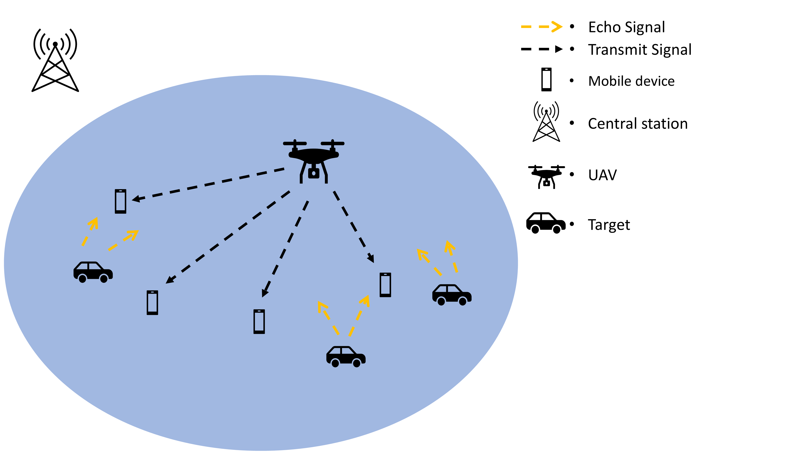
The UAV communicates with users and localizes targets in a DFRC setup.

---

### **Fig. 2: Trilateration-Based Localization**
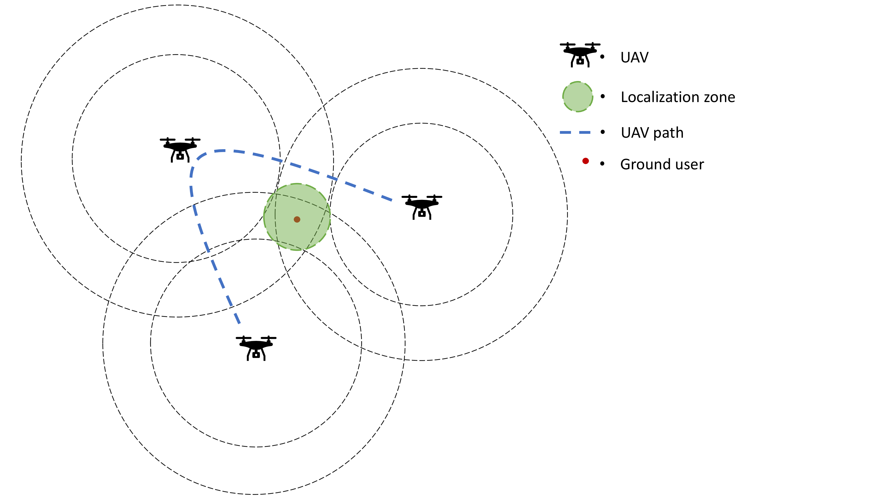
Concentric RSSI circles are used to estimate user positions.

---

### **Fig. 3: Power Consumption vs UAV Speed**
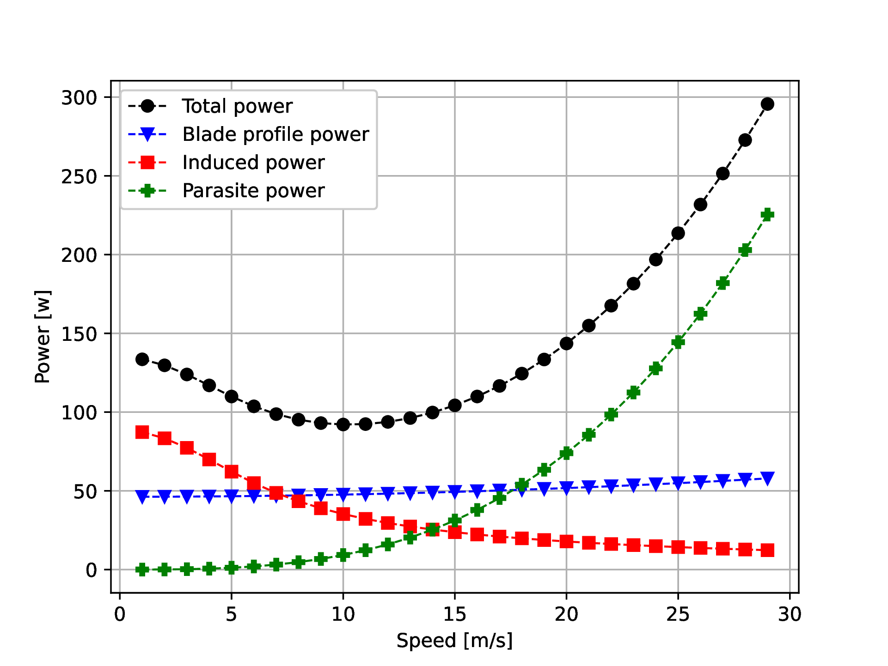
Shows the relationship between speed and power consumption components.

---

### **Fig. 4: RSSI Ring Intersections**
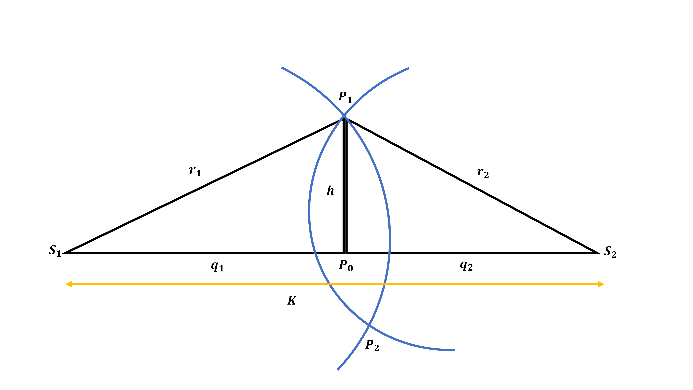
Illustrates how two RSSI-based measurements help localize targets.

---

### **Fig. 5: Training Curves**
- **(a)** Transmitted Bits  
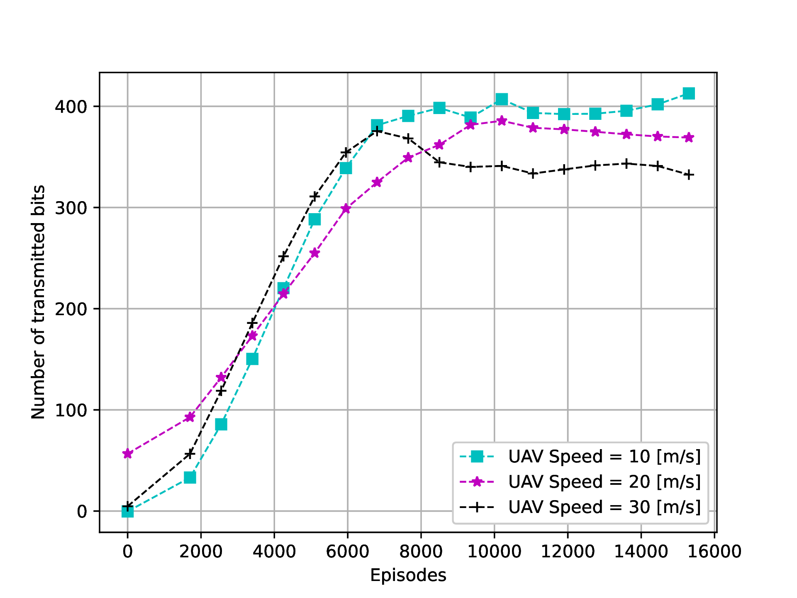
- **(b)** Localization Error  
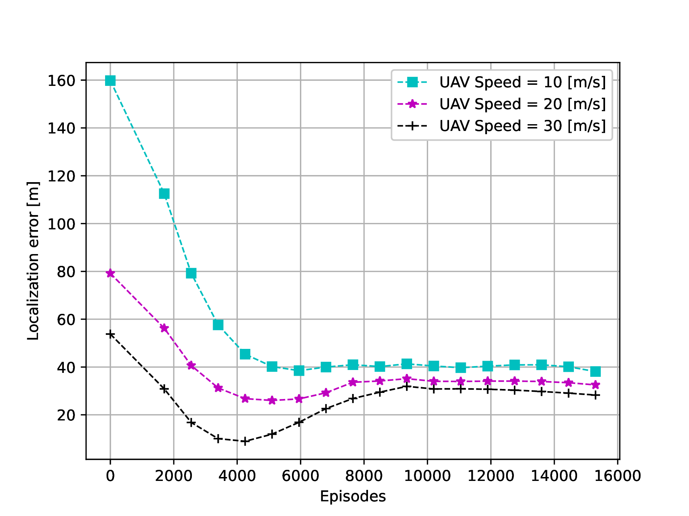
- **(c)** UAV Flight Time  
  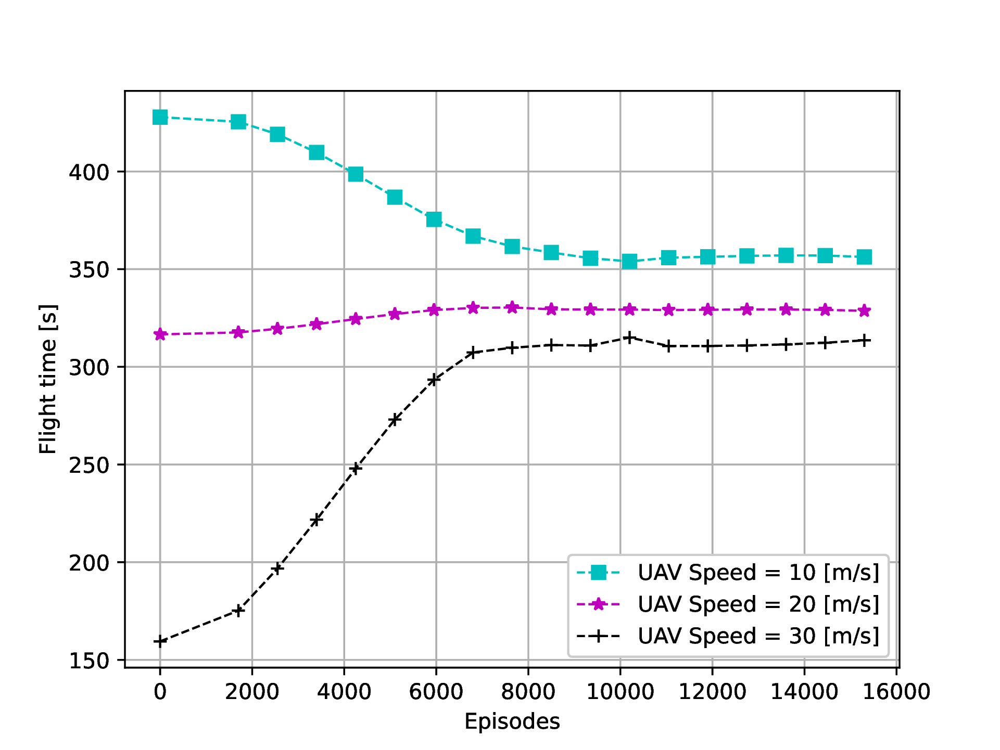

DDQN training results showing convergence of key objectives.

---

### **Fig. 6: Impact of UAV Speed**
- **(a)** Throughput vs. Localization Error  
  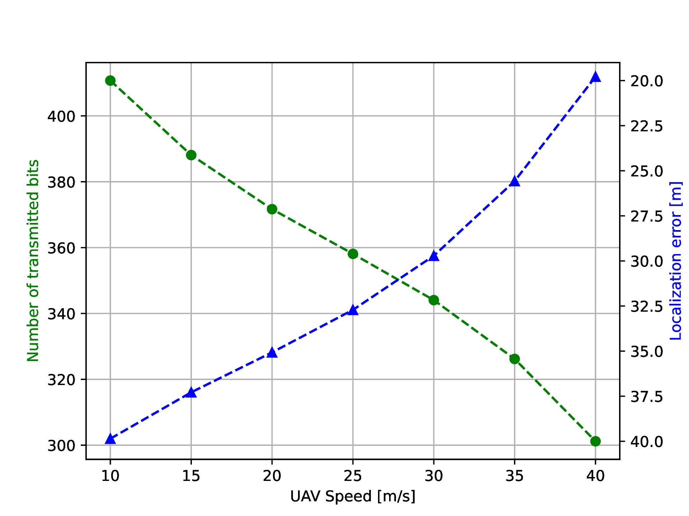
- **(b)** UAV Flight Time  
  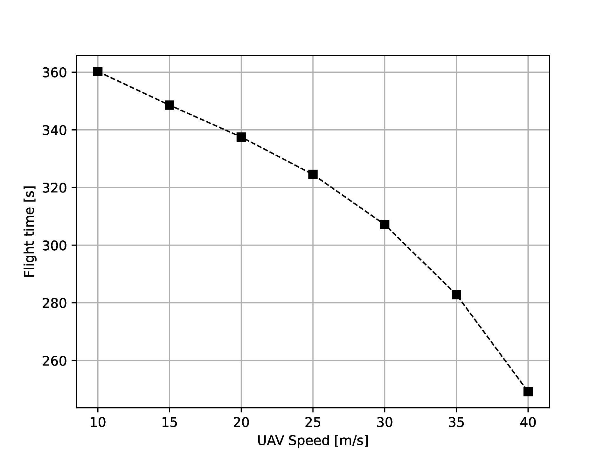

Trade-offs observed as UAV speed changes.

---

### **Fig. 7: Performance Under Different Reward Weights**
- 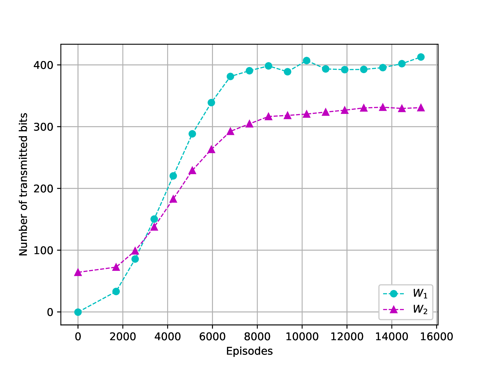
- 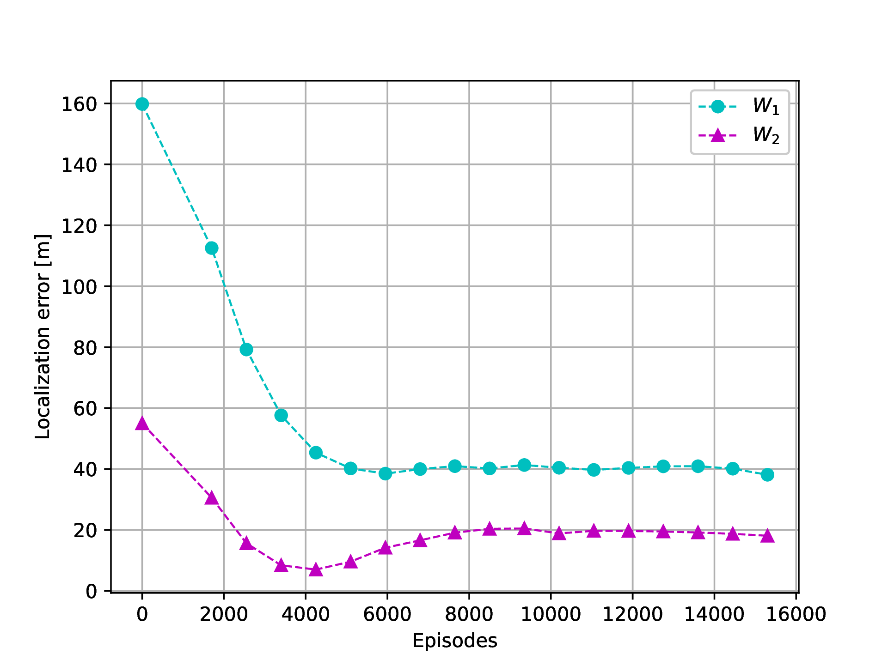
- 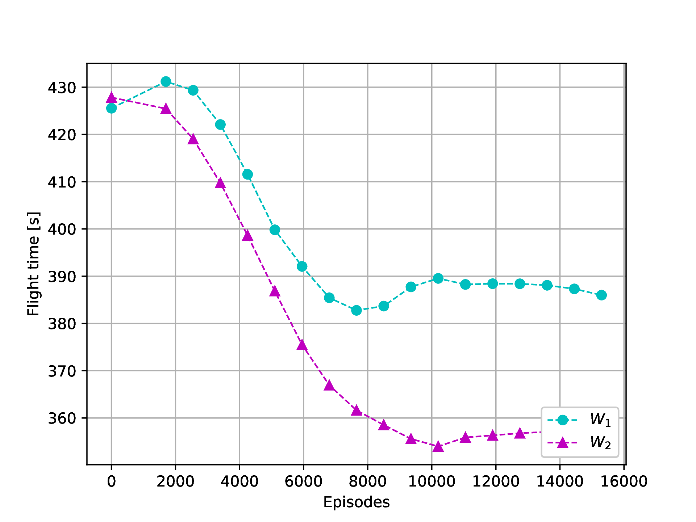

Comparison of performance with different weight settings for throughput vs. localization.

## Citation

If you use this code, please cite the associated [Machine Learning Techniques for UAV-assisted Networks](https://theses.hal.science/tel-03889218/file/118554_SHAHBAZI_2022_archivage.pdf).


## License

This project is licensed under the MIT License. See the `LICENSE` file for details.

## Acknowledgements

This research was supported by the European Commission through the H2020 PAINLESS Project under Grant 812991.
